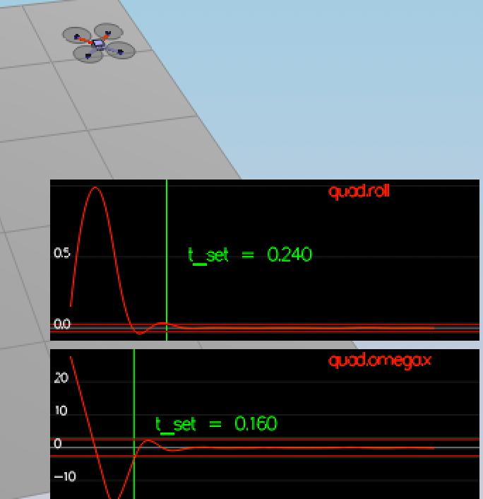
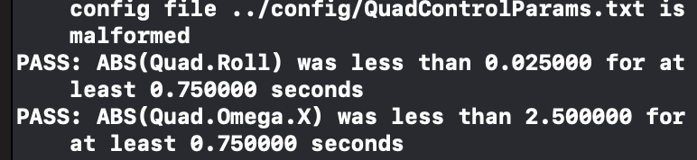
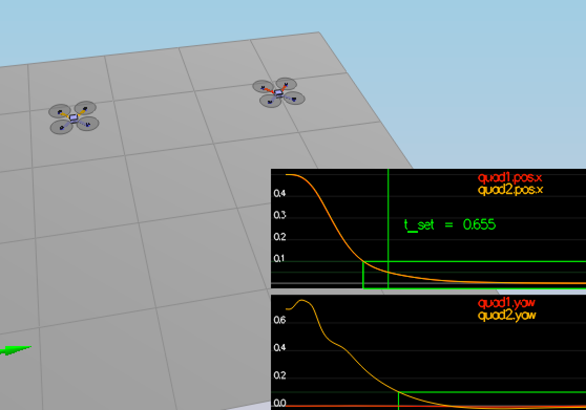
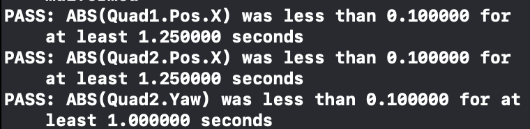
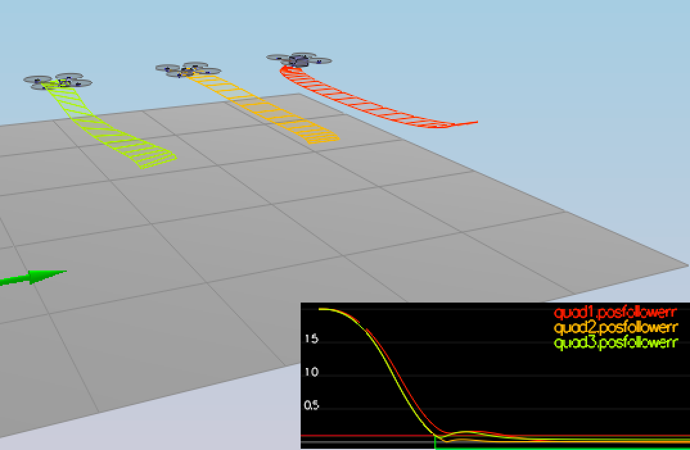
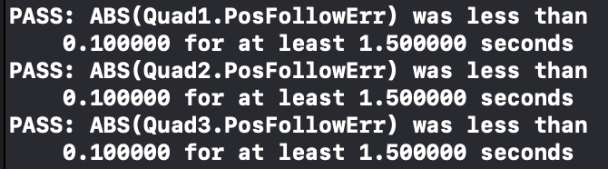

## Body rate and roll/pitch control (scenario 2) ##

We see a quad above the origin.  It is created with a small initial rotation speed about its roll axis.  
Controller will need to stabilize the rotational motion and bring the vehicle back to level attitude.

### Implementing body rate control
#### Implement the code in the function `GenerateMotorCommands()`

The main idea is to distribute thrust across motors to get the desire trhusts and moments. 
```
cmd.desiredThrustsN[0] = collThrustCmd / numRotors; // front left
cmd.desiredThrustsN[1] = collThrustCmd / numRotors; // front right
cmd.desiredThrustsN[2] = collThrustCmd / numRotors; // rear left
cmd.desiredThrustsN[3] = collThrustCmd / numRotors; // rear right
```

For calculating moments we need to calculate the distance to the axes
```float l = L/sqrt(2);```. Absolute value for an applied moment should be equally distributed
across all motors `float xMomentThrustCmd = momentCmd.x/(numRotors*l);`
And because we have drag we have some moment across Z so we can neutralize it: 
`float zMomentThrustCmd = momentCmd.z / (numRotors * kappa) `

And to get the desired moment across required axes we need to apply calculated absolute value
to different motors with different signs without changing vertical thrust and other moments.
For example in order to roll clockwise to fly to the right we need to have higher thrust on the left motors
and lower thrust on the right motors.
```
cmd.desiredThrustsN[0] += xMomentThrustCmd; // front left
cmd.desiredThrustsN[1] -= xMomentThrustCmd; // front right
cmd.desiredThrustsN[2] += xMomentThrustCmd; // rear left
cmd.desiredThrustsN[3] -= xMomentThrustCmd; // rear right
```

We could further simply this all by just calculating the final thrust for each motor but I left 
it like this for simplicity in understanding how we've got to this desired thrusts.

The final thing is not to forget to apply the constraint on the maximum thrust on each motor.


#### Implement the code in the function `BodyRateControl()`
We should calculate the error between actual and commanded rotation rates across 3 axes in the body frame and use moments of intertia to calculate the commanded moment

```
V3F rateError = pqrCmd - pqr;
V3F momentsOfIntertia = V3F(Ixx, Iyy, Izz);
momentCmd = momentsOfIntertia * kpPQR * rateError;
```

#### Tune `kpPQR` in `QuadControlParams.txt` to get the vehicle to stop spinning quickly but not overshoot
After a lot of trial and error we've got the following working configuration
`kpPQR = 90, 90, 5` (which I later changed to `60, 60, 5` to better follow trajectory in the 5th scenario). 
Decreasing it too much will cause instability (20,20,5), increasing too much will have troubles following the trajectory (200,200,20),
    
We see the rotation of the vehicle about roll (omega.x) get controlled to 0 while other rates remain zero. 

### Implement roll / pitch control

#### implement the code in the function `RollPitchControl()`
In order to control the pitch and roll, we need to switch from the world frame to the body frame
to calculate the desired rotation rates across x and y axes in the body frame.

```
float c_d = collThrustCmd/mass;
    
    if (c_d > 0.0) {
        float target_R13 = -CONSTRAIN(accelCmd.x/c_d, -maxTiltAngle, maxTiltAngle);
        float target_R23 =  -CONSTRAIN(accelCmd.y/c_d, -maxTiltAngle, maxTiltAngle);
        
        float p_cmd = (1/R(2, 2)) * (-R(1, 0) * kpBank * (R(0, 2)-target_R13) + R(0, 0) * kpBank * (R(1, 2)-target_R23));
        float q_cmd = (1/R(2, 2)) * (-R(1, 1) * kpBank * (R(0, 2)-target_R13) + R(0, 1) * kpBank * (R(1, 2)-target_R23));
        pqrCmd = V3F(p_cmd, q_cmd, 0);
    }
    else {
        pqrCmd = V3F(0, 0, 0);
    }
```

#### Tune `kpBank` in `QuadControlParams.txt` to minimize settling time but avoid too much overshoot
After some trials we've set `kpBank = 15`
Decreasing it (5) will create more oscillations before you become parallel, increasing too much (100) will cause rotating across axes and lose control, decreasing to 10 will optimize settle time for normal quadrotors, but it will stop working for quadrotor with the changed center of mass.

We now see the quad level itself, though it is still be flying away slowly since we’re not controlling velocity/position! 
And we see the vehicle angle (Roll) get controlled to 0.

#### Evaluation 
We see on the graphics, how we converge:
<p align="center">

</p>

We see that all tests are passed:
<p align="center">

</p>


## Position/velocity and yaw angle control (scenario 3) ###

We implement the position, altitude and yaw control for out quad.  
In the scenario we create 2 identical quads, one offset from its target point (but initialized with yaw = 0) and second offset from target point but yaw = 45 degrees.

### implement the code in the function `LateralPositionControl()`
The key to success here is not to forget apply a constraint on the maximum speed taking into account
that we're dealing with vectors. And then we just apply PD equation.
 ```
 V3F errPosition = posCmd - pos;
    // we need to normalize the vector keeping it's direction if magnitude was below constraints
    if (velCmd.mag() > maxSpeedXY) {
        velCmd = velCmd * (maxSpeedXY/velCmd.mag());
    }

    accelCmd += kpPosXY*(posCmd - pos) + kpVelXY*(velCmd - vel);

    if (accelCmd.mag() > maxAccelXY) {
        accelCmd = accelCmd * (maxAccelXY/accelCmd.mag());
    }
```   

### implement the code in the function `AltitudeControl()`
Simple PD controller works well here, but for scenario 4 with the incorrect mass estimation
it stopped working. So finally we'll have to implement PID controller to take into account accumulated error.
The important thing not to forget is that z points down, so the thrust should be negative if we want to fly above.

```
float g = 9.81;
    float zErr = posZCmd - posZ;

    // positive down, first forget about it
    velZCmd = CONSTRAIN(velZCmd, -maxAscentRate, maxAscentRate);
    float velZErr = velZCmd - velZ;
    float bZ = R(2,2);
    // without it it worked for the the 2 and 3 scenario and for perfect drone
    // if we have an error in drone mass estimation it really helps
    integratedAltitudeError += zErr * dt;
    // sets in 0.715 with integrated error
    float u1Bar = kpPosZ*zErr + kpVelZ*velZErr + accelZCmd + integratedAltitudeError*KiPosZ;
    
    // keep in mind that thrust is pointing down in this corrdinates system with z pointing down
    float c = -(u1Bar - g)/bZ;
    thrust = mass*c;
```    
    
### tune parameters `kpPosZ` and `kpPosZ` and tune parameters `kpVelXY` and `kpVelZ`
`kpPosXY = 30` worked well, increasing it leads to faster moving but it can overshooot well.
Same is true for `kpPosZ = 30`.
As for velocity control gains `kpVelXY = 10` and `kpVelZ = 10` worked well. If we 
make it smaller (2) it will oscillates a lot but on the right track, if we increase it too much for `kpVelXY` (40) 
it will go completely off path. And for `kpVelZ` if we increase it it too high (100) it will have more problems following the trajectory.

We see that the quads are going to their destination points and tracking error is going down. However, one quad remains rotated in yaw.

What's interesting, that it was stated that for a second order system, such as the one for this quadcopter, 
the velocity gain (`kpVelXY` and `kpVelZ`) should be at least ~3-4 times greater 
than the respective position gain (`kpPosXY` and `kpPosZ`).
In my case this didn't work well. It would be great some feedback from the mentors or reviewers on this issue.


### implement the code in the function `YawControl()`
P controller will work here, we only shouldn't forget that we shouldn't get angles higher that 2*pi.
```
float yawErr = yawCmd - yaw;
yawErr = fmodf(yawErr, 2*F_PI);
yawRateCmd = kpYaw * yawErr;
```

### tune parameters `kpYaw` and the 3rd (z) component of `kpPQR`
`kpYaw = 2` works well. Deecreasing it to 1 will not allow to change yaw to 
commanded position fast enough, increasing too much (10) will cause instability.
3rd component of kpPQR was set to 5, didn't play much with it.


For a second order system, such as the one for this quadcopter, 
the velocity gain (`kpVelXY` and `kpVelZ`) should be at least ~3-4 times greater 
than the respective position gain (`kpPosXY` and `kpPosZ`).

#### Evaluation 
We see on the graphics, how we converge:
<p align="center">

</p>

We see that all tests are passed:
<p align="center">

</p>

### Non-idealities and robustness (scenario 4) ###

At first it was easy to tune only the normal quad. The different-mass stayed below the target.
As for the shifted center of mass I had to tune kpPosXY and kpVelXY in order to fix it.

I've changed Altitude controller from PD to PID, it fixed the problem with different-mass quad.

Also I had to play with velocity and position control gains and set `KiPosZ = 40`
Can increase more up to 70 and it will still work, if we decrease to 5 it it won't be able to fix the error in mass for the drone fast enough'

#### Evaluation 
We see on the graphics, how we converge:
<p align="center">

</p>

We see that all tests are passed:
<p align="center">

</p>

### Tracking trajectories ###

I had to play a bit with kpPQR for drones to follow trajectories more smoothly.
Now it can follow trajectories quite well.

We see on the graphics, how we converge, quad2 is doing better than quad1:
<p align="center">

</p>

We see that tests for quad2 are passed:
<p align="center">


